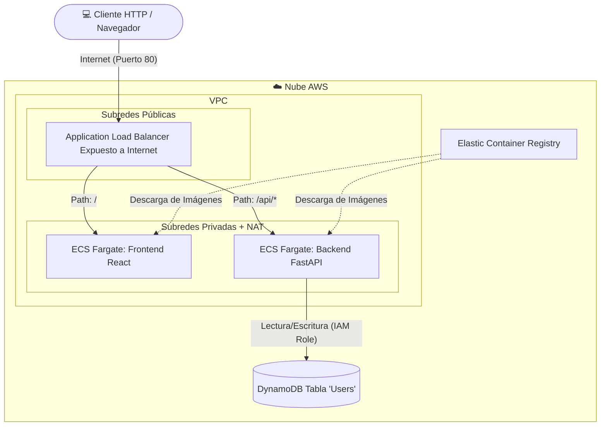

# Prueba Técnica BTG - Gestión de Usuarios (CRUD)

Esta es una aplicación completa (Frontend + Backend + Infraestructura) para gestionar usuarios, diseñada e implementada de acuerdo con los requisitos técnicos proporcionados.

## Requisitos Cumplidos

- ✅ Base de Datos NoSQL (DynamoDB).
- ✅ Aplicación Back-End estructurada (FastAPI con Arquitectura Hexagonal y Swagger Integrado).
- ✅ Aplicación Front-End responsiva e interactiva (React, TypeScript, CSS Custom Glassmorphism).
- ✅ Ambas aplicaciones empaquetadas en Contenedores (Docker).
- ✅ Despliegue en AWS Serverless (Amazon ECS Fargate).
- ✅ Infraestructura automatizada 100% mediante código (Terraform).
- ✅ Integración y Entrega Continua con pipelines automatizados (GitHub Actions).

## Estructura del Proyecto

- `/backend`: Código fuente de la API REST usando Python y FastAPI.
  - Implementa Arquitectura Hexagonal aislando Dominio, Casos de Uso y Adaptadores (DynamoDB, API).
  - Incluye `Dockerfile` basado en `python:3.11-slim`.
- `/frontend`: Interfaz de usuario usando React y Vite.
  - UI interactiva diseñada desde cero con CSS puro y componentes modulares.
  - Incluye `Dockerfile` multi-stage compilando estáticos y sirviéndolos a través de NGINX.
- `/infra`: Código Terraform definiendo AWS VPC, Security Groups, Load Balancer, ECS Cluster, ECR y DynamoDB.
- `/.github/workflows`: Pipelines de despliegue automatizado.

## Decisiones Técnicas y Arquitectura

### Diagrama de Arquitectura AWS



1. **Python con FastAPI (Backend):**

   - **Justificación Técnica:** FastAPI es de alto rendimiento, nativo para asincronía y lo más importante: expone automáticamente la especificación Swagger/OpenAPI (`/docs`) basándose en los modelos Pydantic definidos, ahorrando tiempo de desarrollo sin dependencias externas pesadas.
2. **React con Vite (Frontend):**

   - **Justificación Técnica:** Vite reduce el tiempo de compilación a milisegundos. React sigue siendo el ecosistema más robusto y usado del mercado para interfaces gráficas complejas.
3. **Arquitectura Hexagonal:**

   - **Justificación:** Mantiene la lógica de negocio aislada. Intercambiar la base de datos o el framework web en el futuro (ej. pasar de DynamoDB a PostgreSQL) requiere modificar únicamente el "Adaptador", manteniendo intacto el "Caso de Uso" y el "Dominio".
4. **Amazon DynamoDB (Base de Datos):**

   - **Justificación de Costos y Funcionalidad:** Es serverless. En una prueba técnica, DynamoDB permite arrancar instantáneamente y cae dentro del nivel gratuito siempre activo. No requiere VPCs hipercomplejas en IaC como sí lo demandaría un cluster de RDS, manteniendo el costo en Cero Dólares ($0) bajo inactividad.
5. **Amazon ECS Fargate + Application Load Balancer:**

   - **Justificación de Costos y Funcionalidad:** Fargate cobra por segundo de ejecución de recursos asignados al contenedor (aquí usamos 0.25 vCPU y 0.5 GB RAM por componente, algo sumamente barato). El ALB funciona como el proxy reverso principal, enviando de forma segura el tráfico 80 a Frontend y el tráfico 8000 (bajo `/api`) al backend Dockerizado.
6. **Terraform (IaC):**

   - **Justificación:** Estándar agnóstico multiplataforma que permite versionar y replicar el ambiente en segundos o destruirlo (`terraform destroy`) para evitar cargos extras.

## Pasos para el Despliegue Local o en AWS

**1. Despliegue Local de Infraestructura (AWS)**
Requisitos: Terraform instalado y AWS CLI configurado.

```bash
cd infra
terraform init
terraform apply -auto-approve
```

Tomar nota de la salida `alb_dns_name`. En unos minutos la URL estará activa. **La aplicación queda 100% expuesta a internet a través de este Load Balancer público**, cumpliendo con los requisitos de la prueba técnica (`pruebaTecnica.md`). El ALB rebota el tráfico adecuadamente a los servicios backend o frontend (según el path `/` o `/api`) alojados de forma segura en subredes privadas.

**2. Despliegue Local (Simulado) del Software**

```bash
# Terminal 1 - Iniciar Backend
cd backend
pip install -r requirements.txt
uvicorn app.main:app --reload

# Terminal 2 - Iniciar Frontend
cd frontend
npm install
npm run dev
```

**3. Despliegue Automatizado (CI/CD)**
El repositorio cuenta con 3 flujos de GitHub Actions listos:

1. Al inyectar un push a `infra/` el clúster se alinea.
2. Al inyectar un push a `backend/` se construye la imagen y ECS descarga la nueva revisión con zero-downtime.
3. Lo mismo para el path `frontend/`.
